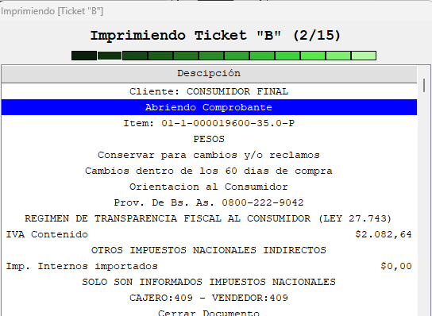

# FiscalClass — Biblioteca Clarion para Controladores Fiscales

Biblioteca de clases Clarion para integración con controladores fiscales electrónicos argentinos. Gestiona la comunicación HTTP/JSON con la impresora, el ciclo de vida completo de comprobantes (facturas, notas de crédito, cierres), auditoría y logging.

**Autor:** Gustavo Saracca  
**Plataforma:** Clarion (CLW/INC)  
**País:** Argentina — Controladores fiscales homologados AFIP  
**Licencia:** [MIT](LICENSE)

---

## Índice

1. [Requisitos y dependencias](#1-requisitos-y-dependencias)
2. [Estructura de archivos](#2-estructura-de-archivos)
3. [Arquitectura general](#3-arquitectura-general)
4. [Configuración inicial (FiscalConfig)](#4-configuración-inicial-fiscalconfig)
5. [Inicialización de conexión (FiscalClass)](#5-inicialización-de-conexión-fiscalclass)
6. [Capa de transporte HTTP (FiscalHTTP)](#6-capa-de-transporte-http-fiscalhttp)
7. [Comandos disponibles](#7-comandos-disponibles)
8. [Orquestador de documentos (FiscalOrchestra)](#8-orquestador-de-documentos-fiscalorchestra)
9. [Tipos y enumeraciones (FiscalTypes)](#9-tipos-y-enumeraciones-fiscaltypes)
10. [Manejo de errores (FiscalErrors)](#10-manejo-de-errores-fiscalerrors)
11. [Logging (FiscalLog)](#11-logging-fiscallog)
12. [Protocolo JSON](#12-protocolo-json)
13. [Flujo de trabajo completo](#13-flujo-de-trabajo-completo)
14. [Referencia de bases de datos](#14-referencia-de-bases-de-datos)

---

## 1. Requisitos y dependencias

### Bibliotecas externas requeridas

| Archivo | Propósito |
|---|---|
| `LibCurl.inc` / `LibCurl.lib` | Comunicación HTTP (POST al controlador fiscal) |
| `cJson.inc` / `cJson.lib` | Serialización/deserialización JSON |
| `..\access\access.lib` | Utilidades de base de datos y presentación de mensajes |
| `..\group\group.lib` | Gestión de variables globales (`ZVar_GetAndSet`) |

#### [mikeduglas/libcurl](https://github.com/mikeduglas/libcurl)

Wrapper Clarion para la biblioteca `libcurl`, que permite realizar peticiones HTTP/HTTPS desde código Clarion nativo. FiscalClass la utiliza a través de `TCurlClass` para enviar los comandos JSON al controlador fiscal mediante HTTP POST al endpoint `http://<ip>/fiscal.json`. Es un requisito indispensable: sin esta biblioteca, todos los comandos fallan con `HTTP:CURL_ERROR`.

> La DLL `libcurl.dll` debe estar disponible en el PATH del sistema o en la carpeta del ejecutable.

#### [mikeduglas/cJSON](https://github.com/mikeduglas/cJSON)

Wrapper Clarion para el parser `cJSON`, que provee serialización y deserialización de documentos JSON. FiscalClass lo utiliza para construir los payloads de cada comando (solicitudes) y para interpretar las respuestas del controlador fiscal (éxito, error, `ControladorOcupado`). Sin esta biblioteca no es posible comunicarse con el controlador, ya que el protocolo completo está basado en JSON.

### Variables globales requeridas (via `ZVar_GetAndSet`)

| Variable | Tipo | Descripción |
|---|---|---|
| `Fiscal.Log` | LONG | `1` = logging habilitado, `0` = deshabilitado |

### Tabla SQL requerida: `pdf_config`

```sql
-- Mapea cada punto de venta (PDF) a la IP del controlador fiscal
pdf_config (
    id_pdf   -- Identificador del punto de venta
    ip       -- Dirección IP del controlador fiscal (ej: "192.168.1.50")
)
```

### Tabla SQL requerida: `pdf_fiscales`

```sql
-- Mapea el número de serie fiscal a configuración del punto de venta
pdf_fiscales (
    serie    -- Número de serie del controlador (ej: "A12345678")
    prefijo  -- Prefijo del comprobante (ej: "0001")
    marca    -- 1=Epson, 2=Hasar, 9=Virtual
    modelo   -- Ver enumeración Fiscal_Type en FiscalTypes.inc
    if_nc    -- Flag notas de crédito
)
```

---

## 2. Estructura de archivos

```
FiscalClass/
│
├── FiscalTypes.inc               ← Enumeraciones y constantes globales
│
├── FiscalConfig.clw / .inc       ← Singleton de configuración global
├── FiscalLog.clw / .inc          ← Subsistema de logging
├── FiscalErrors.clw / .inc       ← Registro de códigos de error
├── FiscalTools.clw / .inc        ← Utilidades (zonas, flags de texto)
│
├── FiscalHTTP.clw / .inc         ← Capa HTTP con LibCurl
├── FiscalCommand.clw / .inc      ← Clase base de comandos + lógica de reintentos
│
├── FiscalClass.clw / .inc        ← Coordinador principal (conexión, inicialización)
│
│   ── Comandos específicos ──
├── FiscalInicializacion.clw / .inc   ← Consulta datos del controlador
├── FiscalConsultarEstado.clw / .inc  ← Estado actual del controlador
├── FiscalCancelar.clw / .inc         ← Cancelar operación en curso
├── FiscalCierreX.clw / .inc          ← Informe X (subtotal sin borrar)
├── FiscalCierreZ.clw / .inc          ← Cierre Z (cierre diario definitivo)
├── FiscalAuditDate.clw / .inc        ← Auditoría por rango de fechas
├── FiscalAuditNumber.clw / .inc      ← Auditoría por rango de número Z
├── FiscalCopiarComprobante.clw / .inc← Reimpresión de comprobante
│
├── FiscalOrchestra.clw / .inc    ← Orquestador de alto nivel (workflow completo)
├── FiscalMail.clw                ← Envío de documentos por correo
│
└── PulseBarClass.clw / .inc      ← Control visual de progreso (barra animada)
```

---

## 3. Arquitectura general

La biblioteca está organizada en capas bien definidas:

```
┌─────────────────────────────────────────────────────┐
│                FiscalOrchestra                       │  ← Capa de aplicación
│         (workflow, UI, cola de comandos)             │
└─────────────────┬───────────────────────────────────┘
                  │ usa
┌─────────────────▼───────────────────────────────────┐
│   FiscalInicializacion  FiscalCierreZ  FiscalCierreX │  ← Comandos concretos
│   FiscalConsultarEstado FiscalCancelar FiscalAudit…  │
└─────────────────┬───────────────────────────────────┘
                  │ heredan
┌─────────────────▼───────────────────────────────────┐
│              FiscalCommand / FiscalCommandClass       │  ← Base: JSON + reintentos
└─────────────────┬───────────────────────────────────┘
                  │ hereda
┌─────────────────▼───────────────────────────────────┐
│                   FiscalHTTP                          │  ← HTTP POST via LibCurl
└─────────────────────────────────────────────────────┘

Transversal a todas las capas:
  FiscalConfig  (singleton de configuración)
  FiscalLog     (logging a archivo)
  FiscalErrors  (catálogo de errores)
```

### Jerarquía de herencia de clases

```
FiscalHTTP
  └─ FiscalCommandClass
       └─ FiscalCommand          (wrapper con reintentos automáticos)
            ├─ FiscalInicializacion
            ├─ FiscalConsultarEstado
            ├─ FiscalCancelar
            ├─ FiscalCierreX
            ├─ FiscalCierreZ
            ├─ FiscalAuditDate
            ├─ FiscalAuditNumber
            └─ FiscalCopiarComprobante
```

---

## 4. Configuración inicial (FiscalConfig)

`FiscalConfig` es un objeto global singleton (instancia única compartida). No debe ser instanciado manualmente; se accede a través de su instancia global.

### Propiedades configurables

| Método | Descripción |
|---|---|
| `SetIP(string)` | IP del controlador fiscal |
| `SetSerial(string)` | Número de serie del controlador |
| `SetMarca(long)` | Marca: `1`=Epson, `2`=Hasar, `9`=Virtual |
| `SetModelo(long)` | Modelo (ver `Fiscal_Type` en FiscalTypes.inc) |
| `SetPrefijo(string)` | Prefijo del punto de venta (ej: `"0001"`) |
| `SetNC(long)` | Flag notas de crédito |
| `SetIIBB(string)` | Número de inscripción IIBB |
| `SetCondIVA(long)` | Condición frente al IVA |
| `SetLogEnable(long)` | Habilitar/deshabilitar logging |
| `SetLogFilename(string)` | Ruta base del archivo de log |
| `SetMsgBox(long)` | Controla presentación de mensajes |

### Mapeo de marca a string

```
1 → "Epson"
2 → "Hasar"
9 → "Virtual"
```

### Mapeo de modelo a string

```
Fiscal_TM2000AF    → "TM2000AF"
Fiscal_TM2000AFplus→ "TM2000AF+"
Fiscal_TMU220AF    → "TMU220AF"
Fiscal_ND_3        → "N/A-3"
Fiscal_ND_5        → "N/A-5"
Fiscal_LX300       → "LX-300"
Fiscal_Hasar_441   → "441"
Fiscal_Hasar_1000  → "1000"
```

---

## 5. Inicialización de conexión (FiscalClass)

`FiscalClass` coordina la inicialización completa leyendo la configuración desde la base de datos.

### Métodos principales

| Método | Descripción |
|---|---|
| `SetPDF(long)` | Define el ID del punto de venta |
| `SetConnectionString(string)` | Cadena de conexión SQL |
| `Open()` | Ejecuta el flujo completo de inicialización |
| `LoadIP()` | Lee la IP desde `pdf_config` |
| `LoadFiscal()` | Consulta el controlador y carga serial/prefijo |
| `LoadParams()` | Lee marca y modelo desde `pdf_fiscales` |

### Flujo de `Open()`

```
Open()
  ├─ LoadIP()          → Lee ip de pdf_config WHERE id_pdf = @pdf
  ├─ LoadFiscal()      → Ejecuta FiscalInicializacion, guarda serial/prefijo
  └─ LoadParams()      → Lee marca/modelo de pdf_fiscales WHERE serie = @serial
```

### Atributos disponibles tras `Open()`

```clarion
oFiscal.GetPDF()          ! ID del punto de venta
oFiscal.GetPrefijo()      ! Prefijo cargado desde controlador
oFiscal.GetConfigPrefijo()! Prefijo cargado desde base de datos
```

---

## 6. Capa de transporte HTTP (FiscalHTTP)

`FiscalHTTP` encapsula la comunicación HTTP POST usando `TCurlClass` (LibCurl).

### Endpoint

```
POST http://<ip>/fiscal.json
Content-Type: application/json
```

### Atributos de resultado

| Atributo | Descripción |
|---|---|
| `HTTPCode` | Código de respuesta HTTP |
| `HTTPMessage` | Cuerpo de la respuesta (JSON) |
| `HTTPError` | Código de error interno |

### Códigos de error HTTP internos

```clarion
HTTP:CURL_OK    = 0  ! Exitoso
HTTP:CURL_ERROR = 1  ! Error de LibCurl
HTTP:NET_ERROR  = 2  ! Respuesta HTTP 3xx-5xx
```

---

## 7. Comandos disponibles

Todos los comandos heredan de `FiscalCommand` e implementan el método `Run()`.

### 7.1 FiscalInicializacion

Consulta los datos de identificación del controlador fiscal.

**Respuesta relevante:**
- CUIT del emisor
- Razón social
- Número de serie
- Prefijo del punto de venta

```clarion
oInit.Init(oConfig)
IF oInit.Run() = FISCAL_OK
  serial  = oInit.GetSerial()
  prefijo = oInit.GetPrefijo()
  cuit    = oInit.GetCUIT()
END
```

### 7.2 FiscalConsultarEstado

Obtiene el estado actual del controlador y el último comprobante emitido.

```clarion
oEstado.Init(oConfig)
IF oEstado.Run() = FISCAL_OK
  estado = oEstado.GetEstado()
  ultimo = oEstado.GetUltimoComprobante()
END
```

### 7.3 FiscalCancelar

Cancela la operación en curso en el controlador.

```clarion
oCancel.Init(oConfig)
oCancel.Run()
```

### 7.4 FiscalCierreX — Informe X

Emite un informe de subtotales **sin borrar** la memoria fiscal. Equivale a un "corte X" en terminología fiscal.

```clarion
oCierreX.Init(oConfig)
IF oCierreX.Run() = FISCAL_OK
  ! Informe impreso en el controlador
END
```

### 7.5 FiscalCierreZ — Cierre diario

Emite el cierre diario definitivo. **Borra los acumuladores** y avanza el contador Z.

```clarion
oCierreZ.Init(oConfig)
IF oCierreZ.Run() = FISCAL_OK
  nroZ    = oCierreZ.GetNroZ()
  totalZ  = oCierreZ.GetTotal()
END
```

> **Importante:** Esta operación es irreversible. El controlador fiscal homologado no permite anular un cierre Z.

### 7.6 FiscalAuditDate — Auditoría por fecha

Imprime el informe de auditoría para un rango de fechas.

```clarion
oAudit.Init(oConfig)
oAudit.SetFechaDesde('20260101')
oAudit.SetFechaHasta('20260131')
oAudit.Run()
```

### 7.7 FiscalAuditNumber — Auditoría por número Z

Imprime el informe de auditoría para un rango de números de cierre Z.

```clarion
oAuditN.Init(oConfig)
oAuditN.SetZDesde(100)
oAuditN.SetZHasta(150)
oAuditN.Run()
```

### 7.8 FiscalCopiarComprobante

Reimprime una copia de un comprobante emitido.

```clarion
oCopia.Init(oConfig)
oCopia.SetNumeroComprobante(12345)
oCopia.Run()
```

---

## 8. Orquestador de documentos (FiscalOrchestra)

`FiscalOrchestra` es el componente de más alto nivel. Gestiona el ciclo de vida completo de un comprobante fiscal, acumulando comandos en una cola y ejecutándolos con una UI de progreso.

### Inicialización

```clarion
oOrch.Init('Emisión Factura B')   ! Título visible en la ventana de progreso
oOrch.SetConfig(oConfig)
```

### Métodos de construcción del documento

#### Cliente (datos del receptor)

```clarion
oOrch.Cliente(
  cuit,          ! CUIT del cliente (string, sin guiones)
  razonSocial,   ! Razón social o nombre
  domicilio,     ! Domicilio completo
  condIVA        ! Ver FiscalCondIVA en FiscalTypes.inc
)
```

#### Título (cabecera del comprobante)

```clarion
oOrch.Titulo(
  tipoDoc,       ! Ver FiscalDocType en FiscalTypes.inc (ej: Doc_FacturaB)
  copias,        ! Cantidad de copias a imprimir
  referencia     ! Número de comprobante de referencia (para NC/ND)
)
```

#### Ítem (líneas del cuerpo)

```clarion
oOrch.Item(
  descripcion,   ! Texto de la línea
  cantidad,      ! Cantidad (DECIMAL)
  precioUnitario,! Precio unitario (DECIMAL)
  ivaCondicion,  ! Ver FiscalIVACond (Gravado, Exento, NoGravado)
  ivaAlicuota,   ! Alícuota de IVA (ej: 21.00)
  codigoProducto ! Código interno del producto
)
```

#### Pago

```clarion
oOrch.Pago(
  medioPago,     ! Ver FiscalPayment en FiscalTypes.inc
  importe,       ! Importe del pago (DECIMAL)
  descripcion    ! Descripción opcional
)
```

#### Percepción

```clarion
oOrch.Percepcion(
  tipoImpuesto,  ! Ver FiscalTaxType
  alicuota,      ! Alícuota
  importe        ! Importe percibido
)
```

#### Bonificación / Descuento

```clarion
oOrch.Bonif(
  descripcion,
  importe,       ! Positivo = descuento, negativo = recargo
  ivaCondicion
)
```

#### Ajuste

```clarion
oOrch.Ajuste(descripcion, importe)
```

#### Cierre del comprobante

```clarion
oOrch.Cierre()
```

### Sección no fiscal (textos sin efecto fiscal)

```clarion
oOrch.TituloNF(texto)     ! Título de sección no fiscal
oOrch.TextoNF(texto)      ! Línea de texto libre
oOrch.CierreNF()          ! Cierre de sección no fiscal
```

### Zonas de texto (header/footer del comprobante)

```clarion
oOrch.ZonaHead(texto, atributos)     ! Encabezado del ticket
oOrch.ZonaFoot(texto, atributos)     ! Pie del ticket
oOrch.ZonaDomicilioEmisor(texto)     ! Domicilio del emisor
oOrch.ZonaFantasia(texto)            ! Nombre de fantasía
```

Los atributos de texto se combinan con OR de bit usando las constantes de `FiscalTextAttr`:

```clarion
! Ejemplo: texto centrado y negrita
attr = FiscalAttr_Centered |: FiscalAttr_Bold
oOrch.ZonaHead('MI EMPRESA S.A.', attr)
```

### Ejecución

```clarion
oOrch.Run()    ! Abre ventana de progreso y ejecuta toda la cola de comandos
```

`Run()` muestra una ventana modal con:
- Lista de comandos pendientes / ejecutados
- Barra animada de progreso (`PulseBarClass`) durante reintentos
- Botón cancelar (pregunta confirmación antes de abortar)



### Cancelación

```clarion
oOrch.Cancelar()    ! Cancela la operación en curso en el controlador
oOrch.AskAbort()    ! Pide confirmación al usuario antes de cancelar
```

---

## 9. Tipos y enumeraciones (FiscalTypes)

Todas las constantes están definidas en [FiscalTypes.inc](FiscalTypes.inc).

### Tipos de controlador (`Fiscal_Type`)

```clarion
Fiscal_TM2000AF    ! Epson TM-2000AF
Fiscal_TM2000AFplus! Epson TM-2000AF+
Fiscal_TMU220AF    ! Epson TM-U220AF
Fiscal_ND_3        ! Genérico N/A-3
Fiscal_ND_5        ! Genérico N/A-5
Fiscal_LX300       ! Epson LX-300
Fiscal_Hasar_441   ! Hasar 441
Fiscal_Hasar_1000  ! Hasar 1000
```

### Tipos de documento (`FiscalDocType`)

```clarion
Doc_FacturaA           Doc_FacturaB           Doc_FacturaC
Doc_NotaDeCreditoA     Doc_NotaDeCreditoB     Doc_NotaDeCreditoC
Doc_NotaDeDebitoA      Doc_NotaDeDebitoB      Doc_NotaDeDebitoC
Doc_ReciboA            Doc_ReciboB            Doc_ReciboC
Doc_TiqueFacturaA      Doc_TiqueFacturaB      Doc_TiqueFacturaC
Doc_TiqueNotaCredito
Doc_InformeDiarioDeCierre    ! Cierre Z
Doc_DetalleDeVentas          ! Informe X
Doc_Remito             Doc_Presupuesto        Doc_MensajeCF
Doc_ComprobanteDonacion
! ... y más de 40 tipos en total
```

### Condición IVA del ítem (`FiscalIVACond`)

```clarion
IVA_Gravado
IVA_Exento
IVA_NoGravado
```

### Responsabilidad IVA del emisor/receptor (`FiscalCondIVA`)

```clarion
IVA_ResponsableInscripto
IVA_Exento
IVA_NoResponsable
IVA_Monotributo
IVA_ResponsableMonotributo
IVA_GranContribuyente
IVA_Consumidor_Final
```

### Medios de pago (`FiscalPayment`)

```clarion
Pay_Efectivo              Pay_Cheque
Pay_TarjetaCredito        Pay_TarjetaDebito
Pay_TransferenciaBancaria Pay_CuentaCorriente
Pay_Vales                 Pay_Otro
! ... más de 30 tipos
```

### Tipos de impuesto adicional (`FiscalTaxType`)

```clarion
Tax_Nacional      Tax_Provincial    Tax_Municipal
Tax_Interno       Tax_IIBB          Tax_PercepcionIVA
```

### Atributos de texto (`FiscalTextAttr`) — flags de bit

```clarion
FiscalAttr_Deleted   = 01H   ! Tachado
FiscalAttr_Wide      = 02H   ! Ancho doble
FiscalAttr_Centered  = 04H   ! Centrado
FiscalAttr_Bold      = 08H   ! Negrita
```

### Estaciones de impresión (`FiscalStation`)

```clarion
Station_Ticket
Station_Slip
Station_Default
```

### Zonas del comprobante (`FiscalZone`)

```clarion
Zone_Fantasia          ! Nombre de fantasía
Zone_Domicilio         ! Domicilio del emisor
Zone_Header1           ! Encabezado línea 1
Zone_Header2           ! Encabezado línea 2
Zone_Footer1           ! Pie línea 1
Zone_Footer2           ! Pie línea 2
```

---

## 10. Manejo de errores (FiscalErrors)

### Flags de estado (combinables con OR de bit)

```clarion
FISCAL_OK              = 000H  ! Sin errores
FISCAL_ERROR           = 001H  ! Error genérico
FISCAL_PRINTER_ERROR   = 002H  ! Error físico de impresora
FISCAL_SYNTAX_ERROR    = 004H  ! Error de sintaxis de comando
FISCAL_NET_ERROR       = 008H  ! Error de red/HTTP
FISCAL_BUSY            = 010H  ! Controlador ocupado
FISCAL_RESPONSE_ERROR  = 020H  ! Respuesta inesperada
FISCAL_UNKNOWN         = 040H  ! Estado desconocido
FISCAL_UNKNOWN_COMMAND = 080H  ! Comando no reconocido
FISCAL_AUX             = 100H  ! Mensaje auxiliar
FISCAL_INTERNAL        = 200H  ! Error interno del controlador
```

### Categorías de mensajes del controlador

Los mensajes del controlador están catalogados en rangos numéricos:

| Rango | Categoría |
|---|---|
| 101–116 | `FISCAL_PRINTER_ERROR` — Error físico de impresora |
| 201–216 | `FISCAL_ERROR` — Error fiscal/lógico |
| 301–307 | `FISCAL_AUX` — Mensajes auxiliares informativos |
| 400–417 | `FISCAL_INTERNAL` — Errores internos del controlador |

### Consulta de descripción de error

```clarion
desc = oErrors.GetErrorDesc(codigo)  ! Retorna descripción en español
```

`FiscalErrors` contiene un catálogo de más de 200 códigos de error clasificados en categorías: Sistema, E/S, Socket, XML, JSON, Criptografía, Imagen, POS, Auditoría, Memoria Fiscal, Aritmética, Base de Datos, Protocolo e Interfaz.

---

## 11. Logging (FiscalLog)

El sistema de logging registra todos los comandos enviados y respuestas recibidas.

### Configuración

```clarion
! Habilitar via variable de entorno (ZVar_GetAndSet)
ZVar_GetAndSet('Fiscal.Log', 1)   ! 1 = activo, 0 = inactivo

! O directamente via FiscalConfig:
oConfig.SetLogEnable(1)
oConfig.SetLogFilename('C:\Logs\fiscal')
```

### Nombre del archivo de log

```
{ruta_base}_{serie}_{YYYY}_{MM}.log
Ejemplo: C:\Logs\fiscal_A12345678_2026_04.log
```

### Formato de entrada

```
[2026-04-24 14:32:10] → {"AbrirComprobante":{...}}
[2026-04-24 14:32:11] ← {"AbrirComprobante":{"Secuencia":"12345",...}}
```

### Uso programático (raramente necesario directamente)

```clarion
oLog.Init(oConfig)
oLog.Write('Mensaje de texto plano')
oLog.Write(cstring_var)
```

Los comandos de `FiscalCommand` llaman a `FiscalLog` automáticamente en cada envío/respuesta.

---

## 12. Protocolo JSON

### Formato de solicitud

```json
{
  "NombreComando": {
    "Parametro1": "valor1",
    "Parametro2": "valor2"
  }
}
```

### Formato de respuesta — Éxito

```json
{
  "NombreComando": {
    "Secuencia": "12345",
    "Estado": {
      "Impresora": ["estado1", "estado2"],
      "Fiscal":   ["estadoFiscal1"]
    },
    "CamposEspecificos": "..."
  }
}
```

### Formato de respuesta — Controlador ocupado

```json
{
  "ControladorOcupado": {
    "Secuencia": "12345",
    "Estado": { ... }
  }
}
```

Cuando el controlador responde `ControladorOcupado`, `FiscalCommand` entra en bucle de reintento automático. La frecuencia y cantidad de reintentos son configurables. Durante la espera, se invoca el callback `MyNotifyClass` que activa la animación de `PulseBarClass`.

### Formato de respuesta — Error

```json
{
  "Error": {
    "Identificador": "CODIGO_ERROR",
    "Descripcion":   "Descripción del error",
    "Contexto":      "Información adicional"
  }
}
```

---

## 13. Flujo de trabajo completo

### Ejemplo mínimo: Factura B

```clarion
  ! 1. Crear y configurar el coordinador de conexión
  oFiscal.SetPDF(idPuntDeVenta)
  oFiscal.SetConnectionString(connStr)
  IF NOT oFiscal.Open()
    Message('Error al conectar con el controlador fiscal')
    RETURN
  END

  ! 2. Crear el orquestador
  oOrch.Init('Emisión Factura B')

  ! 3. Datos del receptor
  oOrch.Cliente('20304050607', 'Juan Perez', 'Av. Corrientes 1234', IVA_Consumidor_Final)

  ! 4. Tipo de comprobante
  oOrch.Titulo(Doc_FacturaB, 1, '')

  ! 5. Ítems
  oOrch.Item('Producto A', 2, 1500.00, IVA_Gravado, 21.00, '001')
  oOrch.Item('Producto B', 1, 800.50,  IVA_Gravado, 10.50, '002')

  ! 6. Pago
  oOrch.Pago(Pay_Efectivo, 3800.50, '')

  ! 7. Cerrar el comprobante
  oOrch.Cierre()

  ! 8. Ejecutar (muestra ventana de progreso)
  oOrch.Run()
```

### Ejemplo: Cierre Z diario

```clarion
  ! Solo ejecutar si se confirmó con el operador
  IF Message('¿Confirma el Cierre Z?', 'Cierre Diario', BUTTON:YesNo) = BUTTON:Yes
    oCierreZ.Init(oConfig)
    IF oCierreZ.Run() = FISCAL_OK
      Message('Cierre Z N° ' & oCierreZ.GetNroZ() & ' realizado correctamente.')
    ELSE
      Message('Error en Cierre Z: ' & oCierreZ.GetLastError())
    END
  END
```

### Ejemplo: Auditoría por fecha

```clarion
  oAudit.Init(oConfig)
  oAudit.SetFechaDesde('20260101')
  oAudit.SetFechaHasta('20260131')
  IF oAudit.Run() <> FISCAL_OK
    Message('Error de auditoría: ' & oAudit.GetLastError())
  END
```

---

## 14. Referencia de bases de datos

### Tabla `pdf_config`

| Campo | Tipo | Descripción |
|---|---|---|
| `id_pdf` | LONG | Identificador del punto de venta |
| `ip` | STRING | IP del controlador fiscal (ej: `"192.168.1.50"`) |

### Tabla `pdf_fiscales`

| Campo | Tipo | Descripción |
|---|---|---|
| `serie` | STRING | Número de serie del controlador |
| `prefijo` | STRING | Prefijo del punto de venta (ej: `"0001"`) |
| `marca` | LONG | `1`=Epson, `2`=Hasar, `9`=Virtual |
| `modelo` | LONG | Constante `Fiscal_Type` (ver sección 9) |
| `if_nc` | LONG | Flag de notas de crédito |

### Consultas ejecutadas por `FiscalClass`

```sql
-- LoadIP()
SELECT ip FROM pdf_config WHERE id_pdf = :pdf

-- LoadParams() (tras obtener serial del controlador)
SELECT prefijo, marca, modelo, if_nc
FROM pdf_fiscales
WHERE serie = :serial
```

---

## Notas para el desarrollador

- **Nunca instanciar `FiscalConfig` directamente**: es un singleton. Acceder siempre a través de su instancia global.
- **El Cierre Z es irreversible**: validar siempre con el operador antes de ejecutarlo.
- **LibCurl debe estar en el PATH o en la carpeta del ejecutable**: sin él, todos los comandos fallan con `HTTP:CURL_ERROR`.
- **El logging crea un archivo por mes**: monitorear espacio en disco en instalaciones con alto volumen de comprobantes.
- **`FiscalOrchestra.Run()` es bloqueante**: abre una ventana modal. Si se necesita integración en un proceso batch sin UI, ejecutar los comandos directamente vía sus clases concretas.
- **Reintentos por `ControladorOcupado`**: el controlador puede estar procesando un trabajo anterior. `FiscalCommand` reintenta automáticamente; el desarrollador puede configurar el número de intentos y el delay entre ellos.
